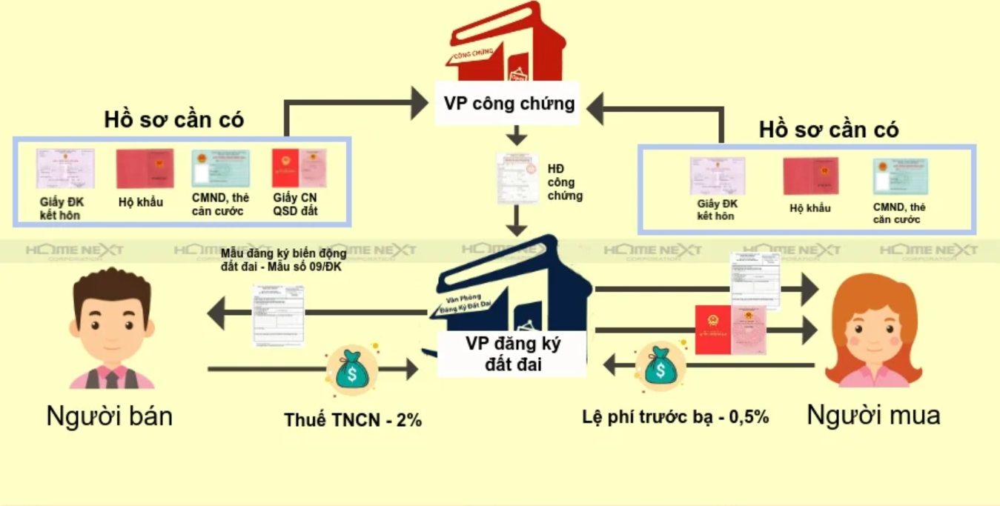
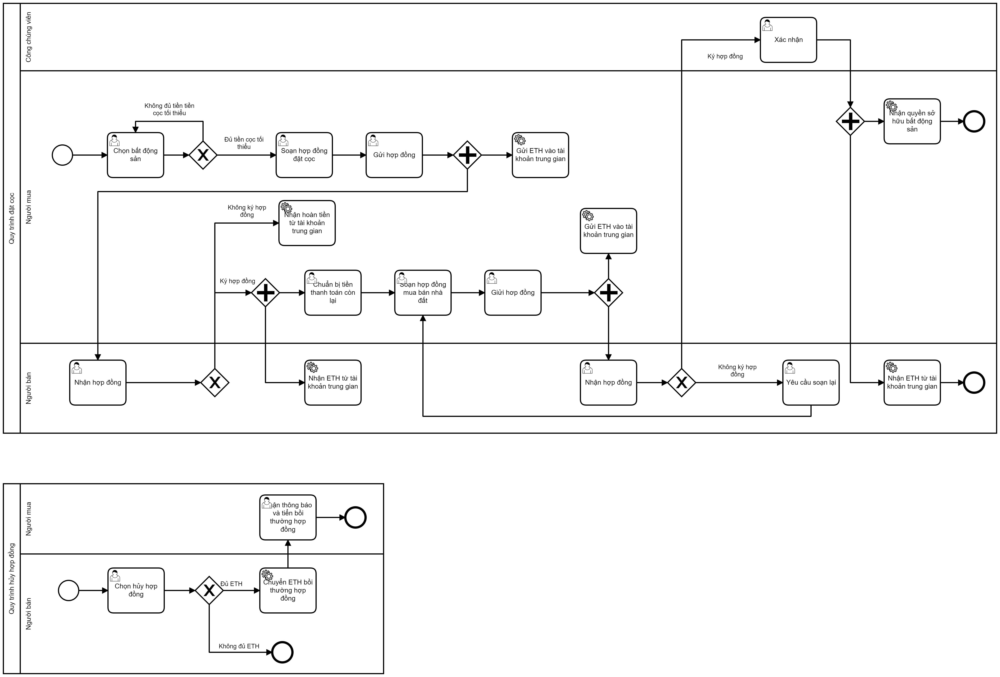

## Quy trình giao dịch bất động sản hiện tại ở nhà nước

1. Đặt cọc (<i>Không bắt buộc</i>).

Các bên mua bán kí hợp đồng đặt cọc và hẹn ngày giao dịch. Có 1 bên thứ 3 tham gia làm chứng (bất kì ai).

2. Công chứng hợp đồng chuyển nhượng.

Các bên gặp nhau ở văn phòng công chứng kí kết và công chứng viên công chứng "hợp đồng chuyển nhượng quyền sử dụng đất". Đồng thời trao thanh toán tiền và giấy tờ đất luôn.

3. Khai báo thuế tại chi cục thuế

Các bên mang toàn bộ hồ sơ đến chi cục thuế để nộp thuế.

- Bên bán: Thuế thu nhập cá nhân 2%
- Bên mua: Thuế trước bạ 0.5%

4. Chuyển tên sổ đỏ

Bên mua mang toàn bộ hồ sơ về văn phòng đăng kí đất đai để làm thủ tục chuyển quyền sở hữu

## Áp dụng vào website hiện tại

### Trường hợp 1: Dùng tiền VND

Sau khi người mua chọn được bất động sản mình thích thì liên hệ với bên bán và thực hiện tất cả các quy trình trên <b>offline</b>. Website chỉ có nhiệm vụ lưu lại các hồ sơ liên quan để có thể tra cứu sau này.

Sau khi hòan tất thủ tục, nhà nước thực hiện chuyển quyền sở hữu tài sản trên hệ thống.

### Trường hợp 2: Dùng Ethereum

- Bước 1: Đặt cọc (<i>Không bắt buộc</i>)

Sau khi chọn được bất đống sản mình thích trên web. Bên mua tạo hợp đồng đặt cọc gửi cho bên bán . Website giợi ý mẫu hợp đồng sẵn, người mua chỉ thay đổi giá trị % đặt cọc, thời gian chuyển tiền còn lại...

Bên bán có thể nhận được nhiều hợp đồng. Những chỉ được chọn 1 hợp đồng để kí kết.

- Bược 2: Tạo hợp đồng chuyển nhượng quyền sở hữu

Bên mua gửi hợp đồng chuyển nhượng quyền sỡ hữu cho bên bán. Nếu bên bán chấp nhận thì xác nhận. Sau đó có thông báo gửi đến công chứng viên. Công chứng viên duyệt thì tiền và quyền sỡ hữu sẽ tự được chuyển. Đồng thời khấu trừ tiền thuế vào tài khoản của nhà nước.

